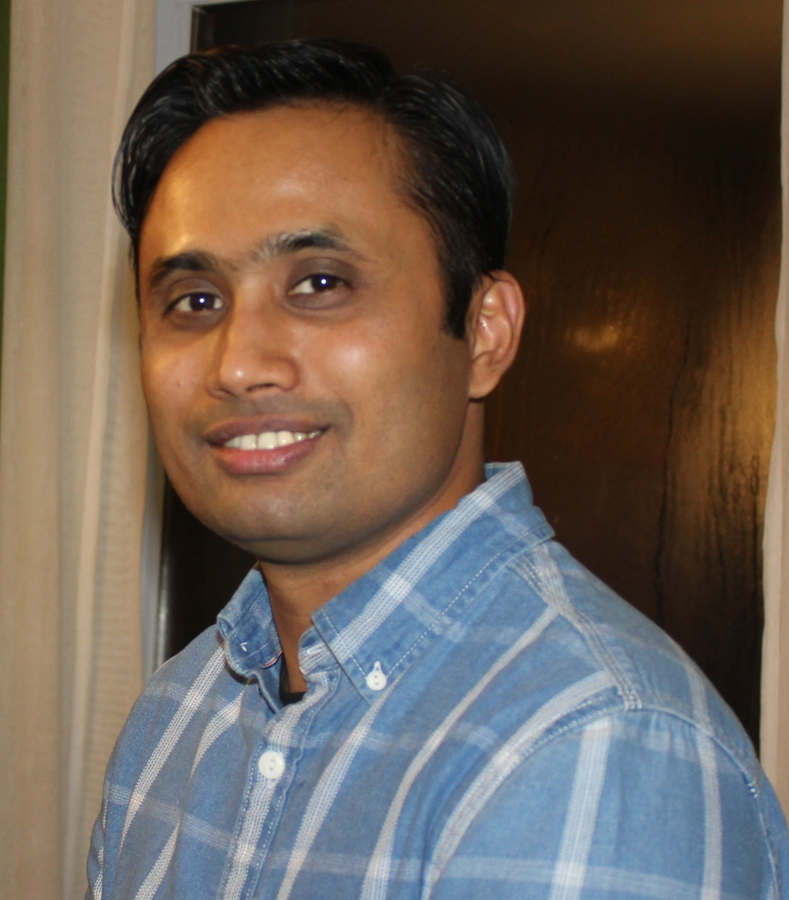

 

    <ul class="nav">
	<li><a href="https://github.com/moshiurmmr">GitHub</a></li>
	<li><a href="https://www.linkedin.com/in/m-moshiur-rahman/">LinkedIn</a></li>
	<li><a href="https://scholar.google.ca/citations?hl=en&user=DLBH9XYAAAAJ&view_op=list_works&gmla=AJsN-F6TgFN0OMsqYPt0Z6tIkJNGwo8xvuwCtpVuD8IIWGA90gRa7M6KsBEOmUFXfn12Dvhb59NuJPAYGNiCt_4bhD8DXpNifbFdAWcfUA4vozz7MyBAqh0">Publications</a></li>	
	<li><a href="https://github.com/moshiurmmr/moshiur_site/tutorials">Tutorial</a></li>
	<li><a href="https://github.com/moshiurmmr/moshiur_site/blog">Blog</a></li>
    </ul>

 

<!-- commenting the following lines

-->

<!--

-->

I am an autonomous vehicle and telematics engineer working for a major vehicle manufacturer in North America.

I have received my PhD in [Electrical Engineering](https://www.etsmtl.ca/ETS/Gouvernance/Decanats-et-departements/departement-genie-electrique) from [ETS, University of Quebec](https://www.etsmtl.ca/) in 2016. Prior to this, I have received my Masters in 
[Telecommunications Engineering](https://offertaformativa.unitn.it/en/lm/telecommunications-engineering) from 
[University of Trento](https://www.unitn.it/en), Trento, Italy in 2011 and my 
B.Sc. in Applied Physics Electronics and Communications Engineering from [University of Dhaka](https://www.du.ac.bd/home) in 2005.

I am a System Architect and Software Engineer with extensive experience in telecommunications and automotive industries. 
At present, my primary work focuses on connected and autonomous vehicles. I am involved in research
in autonmous vehicle technology focusing on vehicle perception using computer vision (CV) and sensor fusion. 

I am working on developing software solutions for [object tracking](https://github.com/moshiurmmr/Object_Tracking_Using_Extended_Kalman_Filter), [lane line detection](https://github.com/moshiurmmr/Lane_Line_Detection), [traffic sign classification](https://github.com/moshiurmmr/Traffic_Sign_Classification), sensor fusion using Kalman Filter.
